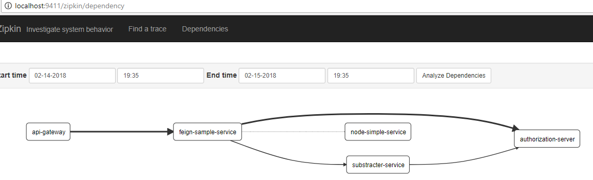

# Spring-microservices-sample 
Sample implementation of microservices architecture based on spring boot and spring cloud framework.

The system is formed by:
* Api gateway, implemented with zuul
* Discovery server, implemented with eureka
* Authorization server, for oauth2
* Zipkin server, a distributed trace system
* 2 basic microservices which use oauth2 authentication and shows sample usage of feign(easy rest clients), ribbon(load balancing) and hystrix(circuit breaker)
* a nodejs microservice called from feign-sample-service using feing, ribbon and histrys. This nodejs microservice uses a zipkin middelware to register it's activity in zipkin server

## System dependency graph from Zipkin server

# TODO
~~terminar systema de logs distribuido~~
implementar UI
preparar despliegue en docker
añadir más microservicios para seguir practicando